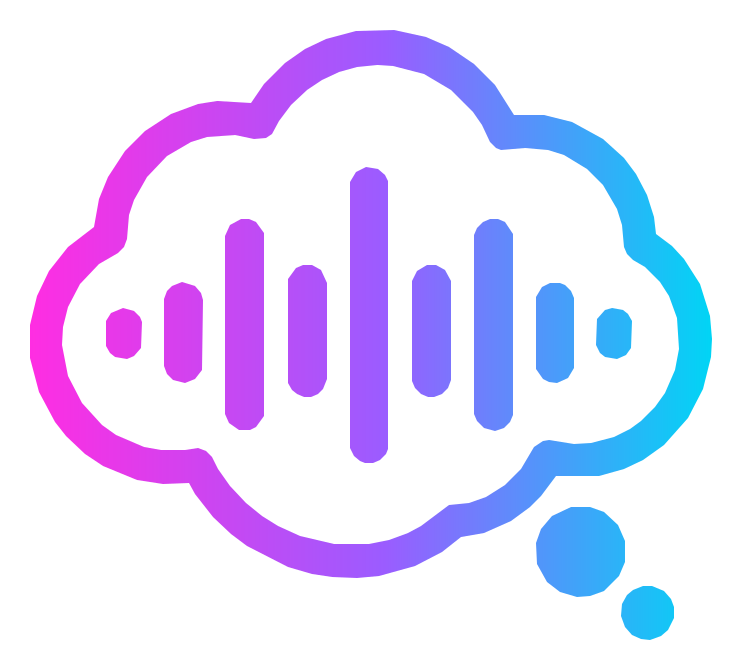
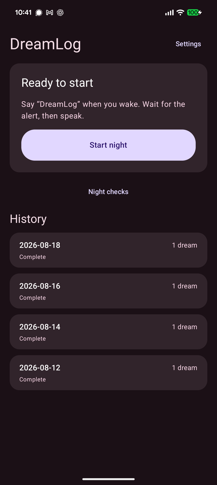
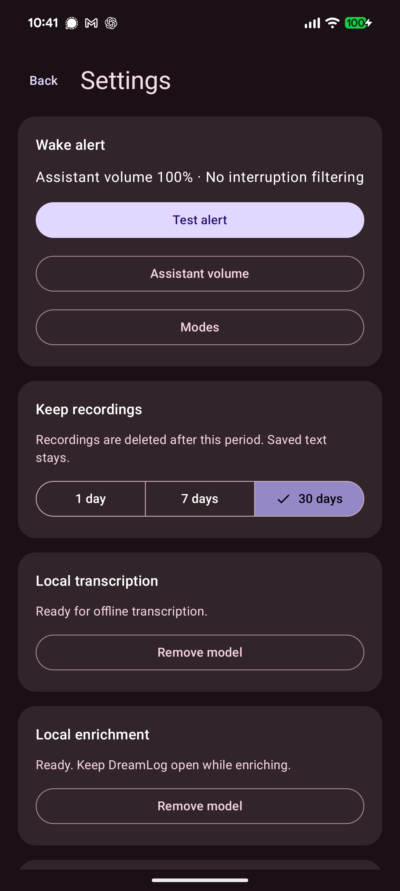
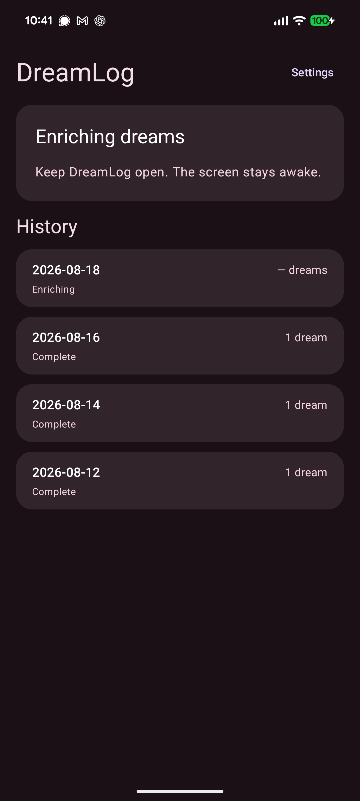
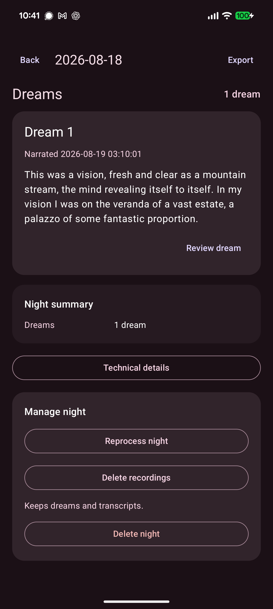

<h1 align="center"> DreamLog</h1>

<p align="center"><strong>Hands-free, screen-off dream capture with local transcription on Android.</strong></p>

<p align="center">
  <a href="https://github.com/wivy1/dreamlog/releases/latest"></a>
  
  <a href="LICENSE"></a>
</p>

DreamLog is an open-source Android app designed to improve dream recall by allowing you to narrate your dreams without sitting up, looking at a screen, or typing. In the morning, all your spoken dreams are transcribed and organized.

## How it works

1. Before your first sleep, open DreamLog and complete the one-time model setup.

   **Stop every other microphone/listening app (e.g. SnoreLab) before starting a DreamLog night.**

2. When you are ready to sleep, open DreamLog and tap **Start night**. The app checks microphone access and notification volume before it enters the waiting state.
3. When you wake, say **"DreamLog"** or **"Hey DreamLog"**, wait for the cue, then speak naturally. You do not need to narrate your dream(s) in perfect chronological order: you can make reference to "the first dream," "the next dream," or "the dream after that" - whatever comes to your mind.
4. When you are finished narrating, simply stop speaking and go back to sleep. DreamLog stops transcribing after 10 seconds of silence and returns to the waiting state.
5. In the morning, tap **End Night**. DreamLog will complete transcription. Then tap **Enrich**, and DreamLog will organize your dream narration into distinct dreams.
6. Open any completed night to review it. One or many dreams can be exported through Android's share/save surfaces as **TXT**, **JSON**, or **CSV**.

## Screenshots

<table>
  <tr>
    <td width="25%" valign="top">
      <p align="center"><strong>Ready to start</strong></p>
      <a href="docs/images/01-ready-to-start.png"></a>
    </td>
    <td width="25%" valign="top">
      <p align="center"><strong>Local model setup</strong></p>
      <a href="docs/images/02-local-models.png"></a>
    </td>
    <td width="25%" valign="top">
      <p align="center"><strong>Enriching a dream</strong></p>
      <a href="docs/images/03-enriching-dreams.png"></a>
    </td>
    <td width="25%" valign="top">
      <p align="center"><strong>Reviewing a dream</strong></p>
      <a href="docs/images/04-enriched-dream.png"></a>
    </td>
  </tr>
</table>

## Private and local

Dream audio, raw transcripts, and organized dreams stay in DreamLog's private local storage. Transcription and optional enrichment run on the phone. Network access is used only for explicit model downloads, and DreamLog never uploads dream content.

## Requirements

Requires Android 12 or newer. First-time setup downloads an offline transcription model of about 75 MB and an optional enrichment model of about 2.66 GB.

[Download the signed APK from the latest GitHub release.](https://github.com/wivy1/dreamlog/releases/latest)

## Build from source

Install Java 17 and an Android SDK containing API 37, then run:

```powershell
.\gradlew.bat :app:assembleDebug
```

Release signing credentials are intentionally excluded from Git. Device integration tests use the isolated `deviceTest` package; do not run `connectedDebugAndroidTest` against an installation containing real data.

Bug reports and focused pull requests are welcome. See [CONTRIBUTING.md](CONTRIBUTING.md).

Third-party runtimes, models, assets, licenses, and exact artifact provenance are documented in [app/THIRD_PARTY_NOTICES.md](app/THIRD_PARTY_NOTICES.md).

## License

MIT.
