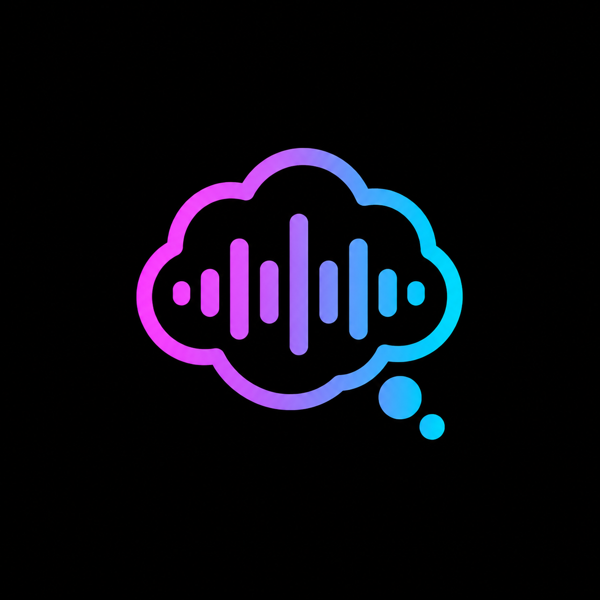

<p align="center">
  
</p>

<h1 align="center">DreamLog</h1>

<p align="center">Hands-free, screen-off dream dictation and fully local transcription for Android.</p>

DreamLog is designed to improve dream recall without making you sit up, look at
a screen, or type. After starting a night, keep your eyes closed and say
**“DreamLog”** or **“Hey DreamLog”** whenever you wake. A short cue confirms the
wakeword, then you can narrate what you remember without touching the phone.

## How it works

1. Before sleep, open DreamLog, complete the one-time model setup, and tap
   **Start night**. The app checks microphone access, wakeword and transcription
   models, storage, recovery state, and other required conditions before it
   enters its ready state.
2. When you remember a dream, say **“DreamLog”** or **“Hey DreamLog”**, wait for
   the cue, and speak naturally. You do not need to tell the story in perfect
   chronological order: work backward from the part you remember and return to
   earlier details during the same narration.
3. When you are finished, simply stop speaking and go back to sleep. DreamLog
   ends that recording after its silence boundary and resumes listening for the
   next wakeword—there is no spoken stop command and nothing to tap.
4. If you have another dream later, say a wakeword and narrate again. Each
   wake-triggered recollection remains isolated from the others.
5. In the morning, tap **End night**. DreamLog transcribes the recordings and
   uses a local enrichment model to organize source-linked dream entries, apply
   conservative casing and punctuation, and place explicit returns to earlier
   details in the relevant part of that narration. The raw transcription is
   preserved separately.

The included wakeword models work without voice training or in-app retraining.

## Private and local

- Captured audio, transcripts, and enriched dreams stay in the app's private
  storage. Dream content is never uploaded.
- Transcription and enrichment run on the phone. Network access is used only
  for explicit, verified model downloads.
- One or many dreams can be exported through Android's share/save surfaces as
  **TXT**, **JSON**, or **CSV**.
- Stop SnoreLab and every other microphone/listening app before starting a
  DreamLog night. Android may expose a competing recorder warning, but DreamLog
  cannot identify or stop every other app that is using the microphone.

## Requirements and limits

The v1.0 APK is arm64-only, requires Android 12 or newer (API 31+), uses en-US,
and has been validated on a Pixel 8 Pro. Other arm64 devices are not yet a
tested compatibility matrix. First-time setup downloads an offline
transcription model of about 75 MB and an optional enrichment model of about
2.66 GB. Morning enrichment runs while DreamLog remains open, and Android may
still interrupt long-running app work.

Download the signed APK from the
[latest GitHub release](https://github.com/wivy1/dreamlog/releases/latest).
Android cannot update a private/debug build with this separately signed public
APK; export anything you need before removing an older debug installation.

## Build from source

Install Java 17 and an Android SDK containing API 37, then run:

```powershell
.\gradlew.bat :app:assembleDebug
```

Release signing credentials are intentionally excluded from Git. Device
integration tests use the isolated `deviceTest` package; do not run
`connectedDebugAndroidTest` against an installation containing real data.

Third-party runtimes, models, assets, licenses, and exact artifact provenance
are documented in [app/THIRD_PARTY_NOTICES.md](app/THIRD_PARTY_NOTICES.md).
DreamLog's original source and artwork currently have no separate public
license grant; third-party components retain their respective licenses.
